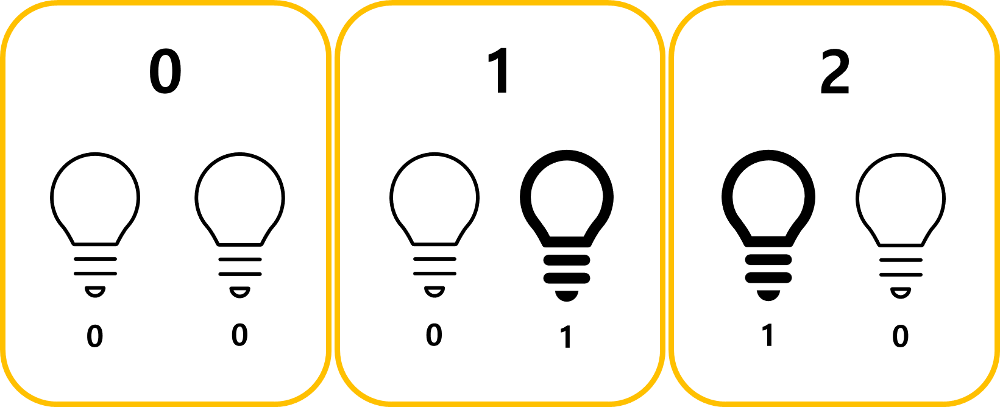
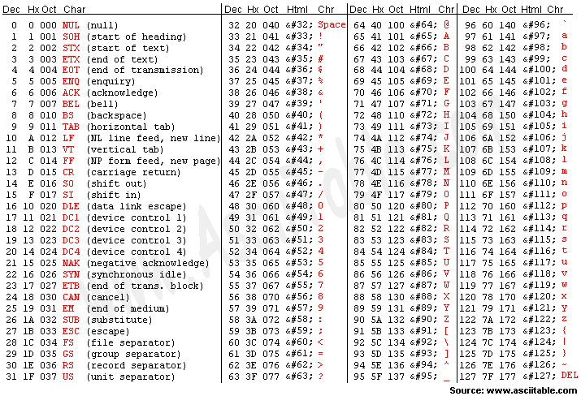

# Week 0 - 컴퓨터 사이언스

### 컴퓨팅적 사고

- **BIt, binary**
    - 1 or 0 / on or of(binary digit, bit) 로 정보를 기록 및 표기
    - 전기 신호로 작동하는 컴퓨터에 적합한 방식이다.
    - binary에서 중요한 것은 순열이다. 1과 0의 순서에 따라 표현하는 정보가 달라진다.
        
        
        
    - 우리는 일상생활에서 십진법을 쓰기 때문에 일의 자리, 백의 자리 등의 순열에 익숙하다. 하지만 이진법도 자릿수를 나타낼 수 있다.
        
        
        
    - 컴퓨터는 이런 숫자 표기법에 다양한 정보를 연결시켜 동작할 수 있다.

- **Byte**
    - 8bit = 1byte
    - 255가지의 정보를 담을 수 있다고 볼 수 있다.

- **ASCII**
    - American Standard Code for Information Interchange의 약자로써 평균적으로 7비트를 사용하는 표현식이다.(Ex 01000001, 65, A)
    
    
    
    - 대부분의 하드웨어에 내장되어 있다.

- **Unicode**
    - ASCII의 상위 집합이라 볼 수 있음
    - 대부분 8바이트를 사용하며 데이터 크기의 확장에 따라 적합한 16진수(BASE-16)을 사용

- **RGB**
    - 위의 ASCII, Unicode와 같은 표현식이며 색상에 대한 표현식이다.
    - Red, Green, Blue를 각각 1바이트(8비트)씩 할당해 255, 255, 255의 색 조합을 할 수 있게 만들었다.

- **그렇다면 만약 같은 값을 가진 표현식을 어떻게 구분해야 할까?**
    - 프로그래밍을 한 주체가 해석 가능하도록 표현식마다 단서를 붙여주어야 함

- **Algorithm**
    - 0 주차 강의에서 가장 재미있는 부분이었다.
    - 알고리즘이란 일상생활에서의 알고리즘, 예를 들면 도서관에서 책을 찾는 행위 같은 논리의 흐름을 컴퓨터에서도 똑같이 행동할 수 있는 논리 구조를 구현하는 것이다.
        - 도서관의 예시를 계속 진행하여 설명해보겠다.
        - 내가 단테의 신곡을 찾고 있다고 가정했을 때 도서관의 입구에서 보이는 책장부터 하나하나 책을 꺼내가며 뒤져볼 수 있을 것이다.
        - 하지만 그것은 효율적이지 않다, 색인에 따라 적합한 자음이 적혀있는 책장으로 가서 찾기 시작한다면 더 효율적일 것이다.
    - 위의 예시처럼 목표에 도달하기 까지 일련의 규칙이 있다면, 이를 통해 더 효율적이고, 정확하게 목표에 도달할 수 있게 만들어야 효율적 알고리즘을 만들었다고 할 수 있다.

- **Pseudocode**
    - Pseudocode, 의사코드라고도 부르며 알고리즘을 구현하기 전 우리의 언어로 적어보는 코드이다.
    - Example. 도서관에서 단테의 신곡 찾기
        - 도서관에 가기
        - 책의 제목의 첫번째 자음을 보기
        - 책장이 첫번째 자음이 적혀있는 책장인지 판단하기 - Loop
            - 아닐 시 다음 책장에서 위의 작업으로 - NO / Bool
            - 맞을 시 현재 책장에서 아래 작업으로 - YES / Bool
        - 작가 이름을 보기
        - 작가 이름의 첫번째 자음과 맞는 칸인지 확인하기
            - 아닐 시 다음 칸에서 위의 작업으로
            - 맞을 시 현재 책장에서 아래 작업으로
        - 책 꺼내기